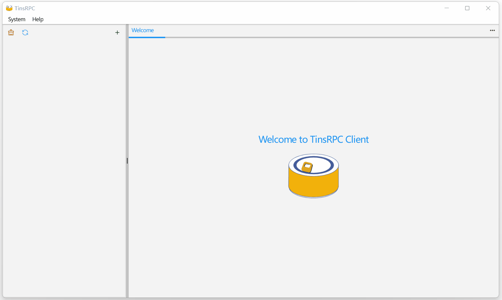

<p align="center">
  
</p>

<div align=center>

[](https://github.com/zevfang/tins-rpc/actions)
[](https://github.com/zevfang/tins-rpc/releases)

</div>

# TinsRPC

[English](README.md) | 简体中文

TinsRPC是一个RPC的客户端工具，满足开发人员的RPC本地调试，目前支持功能相对简单，更多实用功能还在计划中。

### Features

* 跨平台RPC客户端
* 支持.proto文件导入
* 支持向RPCx服务发送请求（一元）
* 支持向gRPC服务发送请求（一元）
* 支持中英文主题
* 支持暗色主题

### Installation

此软件包需要 Go 1.18 或更高版本。可以通过运行以下命令来安装它：

```
go get github.com/zevfang/tins-rpc
```


### Usage

首先你需要安装 [Fyne](https://github.com/fyne-io/fyne) ，然后克隆这个仓库并编译它：
```
fyne package
```

### Build

fyne打包编译
```
fyne package -os windows -icon ./resource/logo.png -name TinsRPC
fyne package -os darwin -icon ./resource/logo.png -name TinsRPC
fyne package -os linux -icon ./resource/logo.png -name TinsRPC
```

本地编译

```
go build -ldflags="-H windowsgui"
```

您可以前往 [release](https://github.com/zevfang/tins-rpc/releases) 页面获取最新的二进制文件。

<p align="center">
  
</p>
